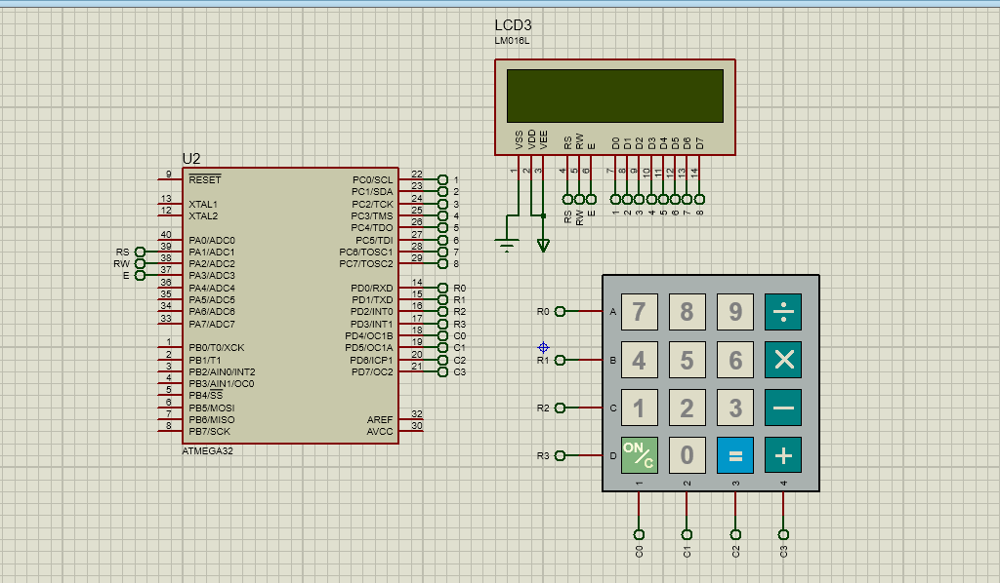

# ATmega32 Calculator Project

This is an **embedded system calculator** implemented on the **ATmega32 microcontroller**.  
It uses a **4x4 keypad** for user input and a **16x2 LCD** for displaying the entered expression and result.

The calculator supports **basic arithmetic operations** (`+`, `-`, `*`, `/`) and evaluates expressions by converting **infix notation to postfix notation** and then calculating the result.

---

## ✨ Features
- Reads numbers and operations from a **4x4 keypad**
- Displays input and results on a **16x2 LCD**
- Supports:
  - Addition (`+`)
  - Subtraction (`-`)
  - Multiplication (`*`)
  - Division (`/`)
- Implements **infix to postfix** conversion for proper operator precedence
- Result shown instantly upon pressing `=`
- `C` key clears the current expression

---

## 🛠 Hardware Requirements
- **ATmega32** Microcontroller
- **4x4 Keypad**
- **16x2 LCD** (HD44780 compatible)
- Breadboard & jumper wires
- Power supply (5V)
- Optional: AVR programmer (USBasp, etc.)

---

## 📜 How It Works
1. **User Input**  
   - Keys are read from the keypad (`Kpad_return_pressed_key` function).
   - Numbers and operators are appended to the input buffer.

2. **Expression Conversion**  
   - Infix expression is converted to postfix notation using `infix_to_postfix()`.

3. **Evaluation**  
   - Postfix expression is evaluated using `eval_postfix()` with a stack-based approach.

4. **Output**  
   - Result is displayed on the LCD.

---


## ▶️ How to Run the Project

1. **Download and extract** the project files from GitHub.  
   The project folder contains:  
   - **hardware/** → Proteus design files  
   - **software/** → Source code and build output  

2. **Compile the software**  
   - Open the project in **Atmel Studio**, `avr-gcc`, or any AVR-compatible IDE.  
   - Build the project — this will generate the `.elf` and `.hex` files inside the `software/build/` folder.  

3. **Open the hardware design in Proteus**  
   - Go to:  
     ```
     /hardware/Proteus_Design/Calculator.pdsprj
     ```  
   - Double-click the **ATmega32** in the schematic.  
   - In the **"Program File"** field, select the compiled `.hex` file from:  
     ```
     /software/build/calculator.hex
     ```

4. **Run the simulation** in Proteus.  
   - Use the **on-screen keypad** to enter numbers and operations.  
   - Press `=` to calculate the result.  
   - Press `C` to clear the screen.

---

## 📸 Demo
> **


---

## Author
**Sama Amer**

- 💼 LinkedIn: [linkedin.com/in/sama-amer-644179364](https://www.linkedin.com/in/sama-amer-644179364)

- 💻 GitHub: [github.com/sama-amer412](https://github.com/sama-amer412)

---
